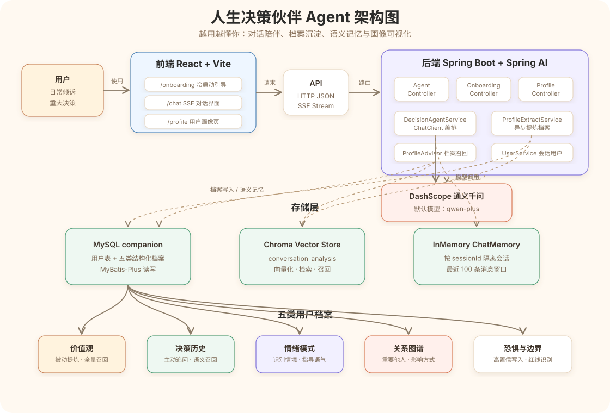

# 人生决策伙伴 Agent

人生决策伙伴 Agent 是一款面向人生选择与日常困惑的 AI 决策陪伴应用。它通过持续对话理解用户的价值观、决策历史、情绪模式、重要关系、恐惧与边界，并把这些长期档案用于后续对话，让建议从一次性问答变成“越用越懂你”的陪伴式分析。

## 核心功能

- 冷启动引导：通过 5 个自然问题完成首次用户画像建立。
- 智能对话：支持普通对话和 SSE 流式对话，适合长回复和实时输出。
- 用户档案沉淀：从对话中自动提炼价值观、决策历史、情绪模式、关系图谱、恐惧与边界。
- 档案可视化：前端展示用户画像完整度和五类档案内容。
- 向量记忆：使用 Chroma 存储对话分析结果，为后续语义召回预留能力。
- API 文档：集成 Springdoc OpenAPI，提供 Swagger UI 调试入口。

## 架构图



## 技术栈

后端：

- Java 17
- Spring Boot 3.5.9
- Spring AI / Spring AI Alibaba
- 通义千问 DashScope，默认模型 `qwen-plus`
- MyBatis-Plus
- MySQL 8.0
- Chroma Vector Store
- Springdoc OpenAPI

前端：

- React 19
- TypeScript
- Vite
- React Router
- Zustand
- Ant Design
- Tailwind CSS

## 项目结构

```text
.
├── docs/                         # PRD、技术方案、接口文档、界面方案
├── frontend/                     # React + Vite 前端应用
├── src/main/java/...             # Spring Boot 后端源码
│   ├── controller/               # REST API 控制器
│   ├── service/                  # 对话、冷启动、档案提炼等服务
│   ├── repository/               # MyBatis-Plus 数据访问层
│   ├── model/                    # 用户与五类档案模型
│   ├── advisor/                  # 档案上下文构建
│   ├── config/                   # AI、数据库、CORS、OpenAPI 等配置
│   └── common/                   # 通用请求、响应和异常处理
├── src/main/resources/
│   └── application.yaml          # 后端配置
├── docker-compose.yml            # MySQL 与 Chroma 本地依赖
├── init.sql                      # 数据库初始化脚本
└── pom.xml                       # Maven 后端工程配置
```

## 环境要求

- JDK 17+
- Maven 3.9+
- Node.js 18+
- Docker / Docker Compose
- DashScope API Key

## 快速启动

### 1. 启动基础服务

```bash
docker compose up -d
```

该命令会启动：

- MySQL：`localhost:3306`
- Chroma：`localhost:8000`

MySQL 默认数据库为 `companion`，默认 root 密码为 `companion123`，初始化表结构来自 `init.sql`。

### 2. 配置后端环境变量

```bash
export DASHSCOPE_API_KEY=你的_DashScope_API_Key
export DB_PASSWORD=companion123
export CHROMA_HOST=localhost
export CHROMA_PORT=8000
```

### 3. 启动后端

```bash
mvn spring-boot:run
```

后端默认运行在：

```text
http://localhost:8080
```

Swagger UI：

```text
http://localhost:8080/swagger-ui/index.html
```

### 4. 启动前端

```bash
cd frontend
cp .env.example .env
npm install
npm run dev
```

前端默认运行在：

```text
http://localhost:5173
```

默认 API 地址配置在 `frontend/.env`：

```env
VITE_API_BASE_URL=http://localhost:8080/api
```

## 主要页面

- `/onboarding`：冷启动引导页
- `/chat`：对话主界面
- `/profile`：用户档案可视化页

## 主要接口

后端统一 API 前缀为 `/api`。

| 模块 | 方法 | 路径 | 说明 |
| --- | --- | --- | --- |
| 对话 | `POST` | `/api/agent/chat` | 普通阻塞式对话 |
| 对话 | `GET` | `/api/agent/chat/stream` | SSE 流式对话 |
| 冷启动 | `GET` | `/api/onboarding/questions` | 获取冷启动问题列表 |
| 冷启动 | `GET` | `/api/onboarding/questions/{step}` | 获取指定步骤问题 |
| 冷启动 | `POST` | `/api/onboarding/answer` | 提交冷启动回答 |
| 冷启动 | `GET` | `/api/onboarding/status/{sessionId}` | 获取冷启动状态 |
| 档案 | `GET` | `/api/profile/{sessionId}` | 获取完整用户档案 |
| 档案 | `GET` | `/api/profile/{sessionId}/values` | 获取价值观档案 |
| 档案 | `GET` | `/api/profile/{sessionId}/decisions` | 获取决策历史 |
| 档案 | `GET` | `/api/profile/{sessionId}/emotions` | 获取情绪模式 |
| 档案 | `GET` | `/api/profile/{sessionId}/relationships` | 获取关系图谱 |
| 档案 | `GET` | `/api/profile/{sessionId}/fears` | 获取恐惧与边界 |
| Chroma | `GET` | `/api/chroma/collections` | 查看向量库集合 |

## 数据档案模型

系统围绕五类用户档案持续积累长期记忆：

1. 价值观档案：用户真正在意的东西，例如稳定性、自由度、家庭距离。
2. 决策历史：用户做过的重要选择、选择原因、结果和感受。
3. 情绪模式：用户在压力、冲突、被催促等场景下的典型反应。
4. 关系图谱：重要他人以及他们对用户选择的影响方式。
5. 恐惧与边界：用户深层恐惧、心理红线和明确不愿触碰的选择。

## 常用命令

```bash
# 后端测试
mvn test

# 前端开发
cd frontend
npm run dev

# 前端构建
cd frontend
npm run build

# 前端代码检查
cd frontend
npm run lint
```

## 许可证

本项目采用 MIT License。
